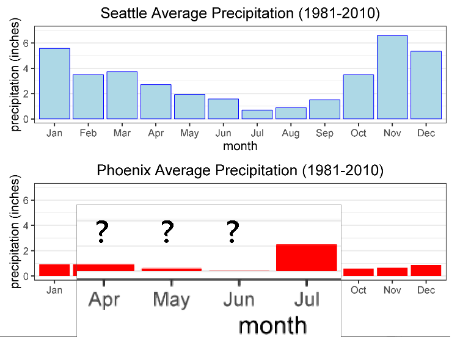
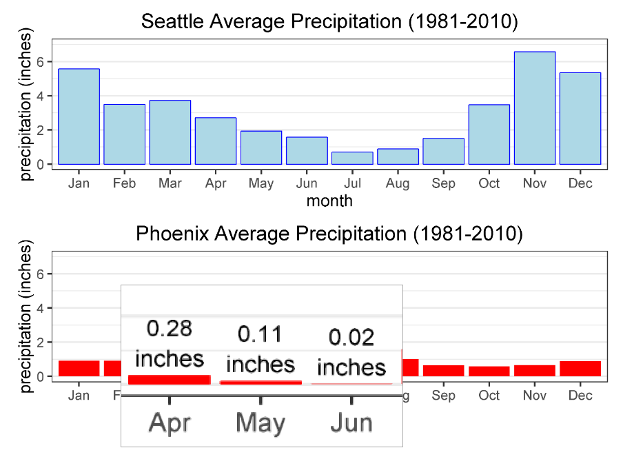

```{r setup, include=FALSE}
knitr::opts_chunk$set(echo = FALSE, message = FALSE)
options(tinytex.verbose = TRUE)

library(ggplot2) # main library for data visualization!

library(reshape2)

library(grid)
library(gridExtra)
library(lemon)

library(dplyr) # for the pipeline operation %>%
library(kableExtra)

# If the compilation does not succeed (resulting a corrupted PDF file),
# then we need to go into "MikTeX Console -> Settings"
# and select "Always install missing packages on-the-fly". 
# Then RStudio can automatically install the required LaTeX packages.
```

# What is Accessibility?

## What is Accessibility?

- Accessibility is the practice of ensuring everyone can access our content,  
**including people with disabilities**. 

\bigskip

- Accessiblity $\neq$ Availability:  
"People often talk about how their applications are accessible 24/7 over the Internet. That is not what we are talking about. That is simply availability. We are talking about accessibility for people with disabilities."
\begin{flushright}
-- Derek Featherstone, Level Access
\end{flushright}

\bigskip

\bigskip

\bigskip

\footnotesize Derek Featherstone. 2015. UX Foundations: Accessibility. LinkedIn Learning.  
<https://www.linkedin.com/learning/ux-foundations-accessibility/>

## Examples of Accessibility: Assistive Technology

Goal: Empower people with disabilities to access online content

\medskip 

Computer magnifier for the vision impaired

```{r magnifier, fig.align="center", out.width = "90%"}
# out.width and out.height are the parameters that control the PDF/HTML output.

```

\footnotesize <https://ghc.anitab.org/>

## Examples of Accessibility: Assistive Technology

Goal: Empower people with disabilities to access online content

\medskip

Closed captioning for the hearing impaired  

```{r closed-captioning, fig.align="center", out.width = "85%"}
# out.width and out.height are the parameters that control the PDF/HTML output.
knitr::include_graphics("images/closed_captioning.png")
```

\scriptsize <https://blog.video.ibm.com/ai-video-technology/the-future-of-closed-captioning-with-ai/>


# Intersection: Data Visualization and Accessibility

## Intersection: Data Visualization and Accessibility

"Data visualization is the presentation of data in a pictorial or graphical format. It enables decision makers to see analytics presented visually, so they can grasp difficult concepts or identify new patterns." 

\begin{flushright}
-- SAS Analytics
\end{flushright}

\bigskip


The goal is to **convey the message to the audience**.  

What's the point when some people cannot even read the graph?

\bigskip

\bigskip

\bigskip

\bigskip

\footnotesize <https://www.sas.com/en_us/insights/big-data/data-visualization.html>

```{r books-setup, include=FALSE}
## Example 1: Books Read per Year

books_read = read.csv("data/books_read_revised.csv")
# Changed the names (Adam, Bob, Charlie) to 
# gender neutral names (Chris, Kelly, Taylor).

new.df = melt(books_read,id.vars="year",
              variable.name="name", value.name="number")

# ---------------------------------------------------------

# 2. What if we print this on black-and-white paper?
# Simulate what people with color blindness would see

# Conversion from color to grayscale
# col2rgb("darkgreen") # red 0, green 100, blue 0
# col2rgb("red") # red 255, green 0, blue 0
# Each value of R color specification ranges from 0 to 255

# Easiest way to convert color to grayscale: (R+G+B)/3 [average method]
# https://www.johndcook.com/blog/2009/08/24/algorithms-convert-color-grayscale/
# But the grayscale ranges from 0 to 1, we need to convert the avg into percent
darkgreen_gray = gray(sum(col2rgb("darkgreen"))/(255*3)) # 0.130719 => "#212121"
red_gray = gray(sum(col2rgb("red"))/(255*3)) # 0.3333333 (should be 1/3) => "#555555"

# I prefer to do the conversion in R code for reproducibility,
# rather than manually printing to .png in black-white mode.
```


## Data visualizations also need to be accessible.

```{r books-inaccessible-color}
# Number of books read per year (inaccessible graph, color)

books_original = ggplot(data=new.df,aes(x=year,y=number,group=name)) +
  xlab("Year") + ylab("Number of Books Read") +
  geom_path(aes(col=name),size=1.5) + 
  geom_point(aes(col=name),size=4.2) +
  scale_x_continuous(breaks=c(2010:2018)) +
  scale_y_continuous(breaks=c(0,2,4,6,8,10)) +
  scale_color_manual(values=c("red","darkgreen","black")) +
  theme_bw(base_size=24) +
  theme(plot.title = element_text(hjust = 0.5),
        axis.text.x = element_text(angle = 45, hjust = 1),
        legend.title=element_blank(),
        legend.key.size = unit(2,"cm"))

books_original

# Only need to save the graph once
# ggsave("graphs/books_original.png",books_original)
```


## Some people cannot see colors, so they will see ...

```{r books-inaccessible-black-white}
# Number of books read per year (inaccessible graph, grayscale)

books_original_BW = ggplot(data=new.df,aes(x=year,y=number,group=name)) +
  xlab("Year") + ylab("Number of Books Read") +
  geom_path(aes(col=name),size=1.5) + 
  geom_point(aes(col=name),size=4.2) +
  scale_x_continuous(breaks=c(2010:2018)) +
  scale_y_continuous(breaks=c(0,2,4,6,8,10)) +
  scale_color_manual(values=c(red_gray,darkgreen_gray,"black")) +
  theme_bw(base_size=24) +
  theme(plot.title = element_text(hjust = 0.5),
        axis.text.x = element_text(angle = 45, hjust = 1),
        legend.title=element_blank(),
        legend.key.size = unit(2,"cm"))

books_original_BW

# Only need to save the graph once
# ggsave("graphs/books_original_BW.png",books_original_BW)
```


## Accessibility increases the size of audience pool

Number of people on this planet with color blindness:  

- Approximately 300 million people

- About 4.5% of the global population

- Almost the same number of the entire US population!

\bigskip

If we incorporate accessibility in data visualizations,  
these people can also be included in the potential audience.

\bigskip

\bigskip

\footnotesize <http://www.colourblindawareness.org/colour-blindness/>


# Example 1: Books Read per Year

## How do we improve accessibility in this graph?

```{r books-inaccessible-color-dup}
# Number of books read per year (inaccessible graph, color)

books_original = ggplot(data=new.df,aes(x=year,y=number,group=name)) +
  xlab("Year") + ylab("Number of Books Read") +
  geom_path(aes(col=name),size=1.5) + 
  geom_point(aes(col=name),size=4.2) +
  scale_x_continuous(breaks=c(2010:2018)) +
  scale_y_continuous(breaks=c(0,2,4,6,8,10)) +
  scale_color_manual(values=c("red","darkgreen","black")) +
  theme_bw(base_size=24) +
  theme(plot.title = element_text(hjust = 0.5),
        axis.text.x = element_text(angle = 45, hjust = 1),
        legend.title=element_blank(),
        legend.key.size = unit(2,"cm"))

books_original
```

## Solution: Change the point shapes and line types

`R` package: `ggplot2` 

\bigskip

`scale_color_manual(values=c("red","darkgreen","black"))`  

`scale_linetype_manual(values=c("dashed","solid","dotted"))`  

`scale_shape_manual(values=c("square","circle","triangle"))`  

## Accessible Graph (Color)

```{r books-accessible-color}
# Number of books read per year (accessible graph, color)

books_accessible = ggplot(data=new.df,aes(x=year,y=number,group=name)) +
  xlab("Year") + ylab("Number of Books Read") +
  geom_path(aes(col=name, linetype=name),size=1.5) + 
  geom_point(aes(col=name, shape=name),size=4.2) +
  scale_x_continuous(breaks=c(2010:2018)) +
  scale_y_continuous(breaks=c(0,2,4,6,8,10)) +
  scale_color_manual(values=c("red","darkgreen","black")) +
  scale_linetype_manual(values=c("dashed","solid","dotted")) +
  scale_shape_manual(values=c("square","circle","triangle")) +
  theme_bw(base_size=24) +
  theme(plot.title = element_text(hjust = 0.5),
        axis.text.x = element_text(angle = 45, hjust = 1),
        legend.title=element_blank(),
        legend.key.size = unit(2,"cm"))

books_accessible

# Only need to save the graph once
# ggsave("graphs/books_accessible.png",books_accessible)
```

## Accessible Graph (Without Color)

```{r books-accessible-black-white}
# Number of books read per year (accessible graph, grayscale)

books_accessible_BW = ggplot(data=new.df,aes(x=year,y=number,group=name)) +
  xlab("Year") + ylab("Number of Books Read") +
  geom_path(aes(col=name, linetype=name),size=1.5) + 
  geom_point(aes(col=name, shape=name),size=4.2) +
  scale_x_continuous(breaks=c(2010:2018)) +
  scale_y_continuous(breaks=c(0,2,4,6,8,10)) +
  scale_color_manual(values=c(red_gray,darkgreen_gray,"black")) +
  scale_linetype_manual(values=c("dashed","solid","dotted")) +
  scale_shape_manual(values=c("square","circle","triangle")) +
  theme_bw(base_size=24) +
  theme(plot.title = element_text(hjust = 0.5),
        axis.text.x = element_text(angle = 45, hjust = 1),
        legend.title=element_blank(),
        legend.key.size = unit(2,"cm"))

books_accessible_BW

# Only need to save the graph once
# ggsave("graphs/books_accessible_BW.png",books_accessible_BW)
```

## `R` Point Shapes: Options Available

```{r point-shape-table}
# Someone else's code online
# http://sape.inf.usi.ch/quick-reference/ggplot2/shape

# Create the R pch table (pch = point shape)
d=data.frame(p=c(0:25))

r_pch_table = ggplot() +
  scale_y_continuous(name="",breaks=c(0.5,1.5,2.5)) +
  scale_x_continuous(name="",breaks=c(0.5,1.5,2.5,3.5,4.5,5.5)) +
  scale_shape_identity() +
  geom_point(data=d, mapping=aes(x=p%%7, y=3-p%/%7, shape=p), size=8, fill="red") +
  geom_text(data=d, mapping=aes(x=p%%7, y=3-p%/%7+0.35, label=p), size=8) +
  theme_bw(base_size=24)+
  theme(axis.text.x = element_blank(),axis.text.y = element_blank(),
        axis.ticks = element_blank(),
        panel.grid.major = element_line(color="black"),
        panel.grid.minor = element_blank())

r_pch_table

# Only need to save the graph once
# ggsave("graphs/r_pch_table.png",r_pch_table)
```

## `R` Line Types: Options Available

```{r line-type-table}
# Also create the R lyt table (lyt = line type)

# https://www.datanovia.com/en/blog/line-types-in-r-the-ultimate-guide-for-r-base-plot-and-ggplot/

# This code does not work.
# library(ggpubr)
# show_line_types()

# The list of line types available in R, includes:
# 0. "blank", 1. "solid", 2. "dashed", 3. "dotted", 
# 4. "dotdash", 5. "longdash" and 6. "twodash".

# Six horizontal lines
lyt = c("0. blank","1. solid","2. dashed","3. dotted",
        "4. dotdash","5. longdash","6. twodash")
dd = data.frame(lyt)

fixed = 2

r_lyt_table = ggplot(dd) +
  scale_x_continuous(name="",breaks=c(0,1))+
  scale_y_continuous(name="",labels=rev(lyt),breaks=seq(from=10,to=70,by=10))+
  geom_hline(yintercept = 70,linetype="blank")+
  geom_hline(yintercept = 60,linetype="solid",lwd=fixed)+
  geom_hline(yintercept = 50,linetype="dashed",lwd=fixed)+
  geom_hline(yintercept = 40,linetype="dotted",lwd=fixed)+
  geom_hline(yintercept = 30,linetype="dotdash",lwd=fixed)+
  geom_hline(yintercept = 20,linetype="longdash",lwd=fixed)+
  geom_hline(yintercept = 10,linetype="twodash",lwd=fixed)+
  theme_bw(base_size=24)+
  theme(axis.text.x = element_blank(),
        axis.ticks = element_blank(),
        panel.grid.minor = element_blank())

r_lyt_table

# Only need to save the graph once
# ggsave("graphs/r_lyt_table.png",r_lyt_table)
```

## Benefits of Accessible Data Visualizations

Accessibility is good business practice because it ...

\bigskip

Improves graph readability for:

- People with color blindness

- People who print the graph in black and white

\bigskip

Saves costs in color printing:

- Journal of the American Statistical Association (JASA) charges  
**$400 for a color figure** if it needs to be printed in color.

\bigskip

\bigskip

\footnotesize <https://www.tandfonline.com/action/authorSubmission?show=instructions&journalCode=uasa20&#pubCharge>

## Benefits of Accessible Data Visualizations

\begincols
  \begincol{.50\textwidth}

Accessible graph

```{r books-accessible-bw-left}
# Number of books read per year (accessible graph, grayscale)

books_accessible_BW = ggplot(data=new.df,aes(x=year,y=number,group=name)) +
  xlab("Year") + ylab("Number of Books Read") +
  geom_path(aes(col=name, linetype=name),size=1.5) + 
  geom_point(aes(col=name, shape=name),size=4.2) +
  scale_x_continuous(breaks=c(2010:2018)) +
  scale_y_continuous(breaks=c(0,2,4,6,8,10)) +
  scale_color_manual(values=c(red_gray,darkgreen_gray,"black")) +
  scale_linetype_manual(values=c("dashed","solid","dotted")) +
  scale_shape_manual(values=c("square","circle","triangle")) +
  theme_bw(base_size=24) +
  theme(plot.title = element_text(hjust = 0.5),
        axis.text.x = element_text(angle = 45, hjust = 1),
        legend.title=element_blank(),
        legend.key.size = unit(2,"cm"))

books_accessible_BW
```

  \endcol
  \begincol{.50\textwidth}

Inaccessible graph: Extra charge!  

```{r books-inaccessible-color-right}
# Number of books read per year (inaccessible graph, color)

books_original = ggplot(data=new.df,aes(x=year,y=number,group=name)) +
  xlab("Year") + ylab("Number of Books Read") +
  geom_path(aes(col=name),size=1.5) + 
  geom_point(aes(col=name),size=4.2) +
  scale_x_continuous(breaks=c(2010:2018)) +
  scale_y_continuous(breaks=c(0,2,4,6,8,10)) +
  scale_color_manual(values=c("red","darkgreen","black")) +
  theme_bw(base_size=24) +
  theme(plot.title = element_text(hjust = 0.5),
        axis.text.x = element_text(angle = 45, hjust = 1),
        legend.title=element_blank(),
        legend.key.size = unit(2,"cm"))

books_original
```

  \endcol
\endcols

## Takeaways: Color Usage in Data Visualizations

\bigskip

- We can use color, but we should not solely rely on color.  
Each trend needs to be distinguishable in the absence of color.

\bigskip

- Accessibility benefits not only people with disabilities,  
but also improves the overall user experience.

\bigskip

\bigskip

\bigskip

\footnotesize Geri Coady. 2017. Color Accessibility Workflows. A Book Apart.  
<https://abookapart.com/products/color-accessibility-workflows>

```{r color-accessibility-book, include=FALSE}
# The book "Color Accessibility Workflows" talks about what color combinations are easier to distinguish by human eye. Many people with color blindness can see blue vs yellow, but they can't see red vs green. There is also research on how human eye perceives shapes.
```


# Example 2: Comparison of Precipitation

```{r seattle-setup, include=FALSE}
# Seattle, Washington's weather data (1981-2010)
# https://en.wikipedia.org/wiki/Seattle
# https://en.wikipedia.org/wiki/Seattle#Climate

seattle = read.csv("data/climate_seattle.csv")
names(seattle)[1] = "month"
seattle$month = factor(seattle$month, level=seattle$month)

# months = c("Jan","Feb","Mar","Apr","May","Jun","Jul","Aug","Sep","Oct","Nov","Dec")
# months = factor(months,levels = months)
```

```{r phoenix-setup, include=FALSE}
# Phoenix, Arizona's weather data (1981-2010)
# https://en.wikipedia.org/wiki/Phoenix,_Arizona
# https://en.wikipedia.org/wiki/Phoenix,_Arizona#Climate

phoenix = read.csv("data/climate_phoenix.csv")
# Decided to name the Phoenix dataset "Arizona" to reduce typos.

names(phoenix)[1] = "month"

phoenix$month = factor(phoenix$month, level=phoenix$month)

# months = c("Jan","Feb","Mar","Apr","May","Jun","Jul","Aug","Sep","Oct","Nov","Dec")
# months = factor(months,levels = months)

# To avoid concerns about missing data, we need to add the actual numbers
# for the Phoenix precipitation for April, May, and June.
# Otherwise, the precipitation bars are too small to see.

phoenix$rain_label = c("","","",phoenix$rain_inches[4:6],"","","","","","")
phoenix$rain_unit = c("","","","inches","inches","inches","","","","","","")
```

## Climate: Seattle vs Phoenix

* Seattle: Oceanic climate

```{r seattle-image, fig.align="center", out.width = "80%"}
# out.width and out.height are the parameters that control the PDF/HTML output.

``` 

* Phoenix: Hot desert climate

```{r phoenix-image, fig.align="center", out.width = "80%"}
# out.width and out.height are the parameters that control the PDF/HTML output.

``` 

\tiny Seattle <https://en.wikipedia.org/wiki/Seattle#Climate>   |   Phoenix <https://carrington.edu/location/phoenix-arizona/>


## Phoenix: High Precipitation in July and August

- In the summer, Phoenix gets thunderstorms $\Rightarrow$ high precipitation.

- "Severe thunderstorms can produce heavy rain, flash flooding, dangerous winds, hail, dust storms and lightning."   

\begin{flushright}
-- Arizona Emergency Information Network
\end{flushright}


```{r phoenix-thunderstorms, include=FALSE}
# In Phoenix, thunderstorms are considered a weather emergency.
```


## Precipitation: Seattle vs Phoenix (Data from Wikipedia)

```{r precipitation-inaccessible}
## Precipitation: Original, non-accessible
# 8. Side-by-side of Precipitation 

plot8a = ggplot(data=seattle,aes(x=month,y=rain_inches)) +
  geom_bar(stat="identity",aes(fill="Seattle"),color="blue") +
  xlab("month") + ylab("precipitation (inches)") +
  scale_y_continuous(limits=c(0,7)) +
  ggtitle("Seattle Average Precipitation (1981-2010)") +
  scale_fill_manual(values=c("Seattle"="lightblue")) +
  theme_bw(base_size=20) +
  theme(plot.title = element_text(hjust = 0.5),
        panel.grid.major.x = element_blank(),
        legend.title=element_blank(),
        legend.position="none")

plot8b = ggplot(data=phoenix,aes(x=month,y=rain_inches)) +
  geom_bar(stat="identity",aes(fill="Phoenix")) +
  xlab("month") + ylab("precipitation (inches)") +
  scale_y_continuous(limits=c(0,7)) +
  ggtitle("Phoenix Average Precipitation (1981-2010)") +
  scale_fill_manual(values=c("Phoenix"="red")) +
  theme_bw(base_size=20) +
  theme(plot.title = element_text(hjust = 0.5),
        panel.grid.major.x = element_blank(),
        legend.title=element_blank(),
        legend.position="none")

rain_original = grid.arrange(plot8a,plot8b)
rain_original

# Only need to save the graph once
# ggsave("graphs/rain_original.png",rain_original)
```


## Concern: Missing data for Phoenix?

```{r phoenix-missing-data, fig.align="center", out.width = "90%"}
# out.width and out.height are the parameters that control the PDF/HTML output.

``` 

## Add labels to address missing data concerns

`R` package: `ggplot2` 

\medskip

* **Create the labels:**  
`phoenix$rain_label = c("","","",phoenix$rain_inches[4:6],"","","","","","")`  
`phoenix$rain_unit = c("","","","inches","inches","inches","","","","","","")`

\medskip

* **Add the labels to `ggplot`:**  
`geom_text(aes(label=rain_label), position=position_dodge(width=0.9),size=6,vjust=-2.25)`  
`geom_text(aes(label=rain_unit), position=position_dodge(width=0.9),size=6,vjust=-0.5)`

## Add labels to address missing data concerns

```{r precipitation-labels}
## Precipitation: Added text labels for tiny bars
# 9. Side-by-side of Precipitation 

plot9a = ggplot(data=seattle,aes(x=month,y=rain_inches)) +
  geom_bar(stat="identity",aes(fill="Seattle"),color="blue") +
  xlab("month") + ylab("precipitation (inches)") +
  scale_y_continuous(limits=c(0,7)) +
  ggtitle("Seattle Average Precipitation (1981-2010)") +
  scale_fill_manual(values=c("Seattle"="lightblue")) +
  theme_bw(base_size=20) +
  theme(plot.title = element_text(hjust = 0.5),
        axis.title.y.right = element_text(angle = 90), # rotate secondary y-axis
        panel.grid.major.x = element_blank(),
        legend.title=element_blank(),
        legend.position="none")

plot9b = ggplot(data=phoenix,aes(x=month,y=rain_inches)) +
  geom_bar(stat="identity",aes(fill="Phoenix")) +
  geom_text(aes(label=rain_label), position=position_dodge(width=0.9), size=5, vjust=-2.25) +
  geom_text(aes(label=rain_unit), position=position_dodge(width=0.9), size=5, vjust=-0.5) +
  xlab("month") + ylab("precipitation (inches)") +
  scale_y_continuous(limits=c(0,7)) +
  ggtitle("Phoenix Average Precipitation (1981-2010)") +
  scale_fill_manual(values=c("Phoenix"="red")) +
  theme_bw(base_size=20) +
  theme(plot.title = element_text(hjust = 0.5),
        axis.title.y.right = element_text(angle = 90), # rotate secondary y-axis
        panel.grid.major.x = element_blank(),
        legend.title=element_blank(),
        legend.position="none")

rain_with_labels = grid.arrange(plot9a,plot9b)
rain_with_labels

# Only need to save the graph once
# ggsave("graphs/rain_with_labels.png",rain_with_labels)
```

## Labels indicate existence of data

```{r phoenix-tiny-bars, fig.align="center", out.width = "90%"}
# out.width and out.height are the parameters that control the PDF/HTML output.

``` 


## Increase the audience pool to global community

- Accessibility is to ensure that **everyone** can access our content.

\bigskip

- Most places outside the United States use the **metric system**.  
e.g. meters, kilograms, Celsius temperature scale

\bigskip

- We also need to consider international people's needs as well.


## Solution: Add a secondary y-axis for mm (millimeter)

`R` package: `ggplot2` 

\bigskip

Add the secondary y-axis for the other unit  

1 inch = 2.54 cm = 25.4 mm (millimeter)  

\bigskip

`scale_y_continuous(sec.axis = sec_axis(~.*25.4,name="precipitation (mm)"))`


## Precipitation: Seattle vs Phoenix (Accessible)

```{r red-blue, include=FALSE}
# Conversion from color to grayscale
# col2rgb("darkgreen") # red 0, green 100, blue 0
# col2rgb("red") # red 255, green 0, blue 0
# Each value of R color specification ranges from 0 to 255

# Easiest way to convert color to grayscale: (R+G+B)/3 [average method]
# https://www.johndcook.com/blog/2009/08/24/algorithms-convert-color-grayscale/
# But the grayscale ranges from 0 to 1, we need to convert the avg into percent
blue_gray = gray(sum(col2rgb("blue"))/(255*3)) # 0.3333333 => "#555555"
lightblue_gray = gray(sum(col2rgb("lightblue"))/(255*3)) # 0.8091503 => "#CECECE"
red_gray = gray(sum(col2rgb("red"))/(255*3)) # 0.3333333 (should be 1/3) => "#555555"

# I prefer to do the conversion in R code for reproducibility,
# rather than manually printing to .png in black-white mode.
```

```{r precipitation-stacked}
## Precipitation: Added a secondary y-axis for mm (millimeter)
# 9. Side-by-side of Precipitation 

plot9a = ggplot(data=seattle,aes(x=month,y=rain_inches)) +
  geom_bar(stat="identity",aes(fill="Seattle"),color="blue") +
  xlab("month") + ylab("precipitation (inches)") +
  scale_y_continuous(limits=c(0,7),
                     sec.axis = sec_axis(~.*25.4,name="precipitation (mm)")) +
  ggtitle("Seattle Average Precipitation (1981-2010)") +
  scale_fill_manual(values=c("Seattle"="lightblue")) +
  theme_bw(base_size=20) +
  theme(plot.title = element_text(hjust = 0.5),
        axis.title.y.right = element_text(angle = 90), # rotate secondary y-axis
        panel.grid.major.x = element_blank(),
        legend.title=element_blank(),
        legend.position="none")

plot9b = ggplot(data=phoenix,aes(x=month,y=rain_inches)) +
  geom_bar(stat="identity",aes(fill="Phoenix")) +
  geom_text(aes(label=rain_label), position=position_dodge(width=0.9), size=5, vjust=-2.25) +
  geom_text(aes(label=rain_unit), position=position_dodge(width=0.9), size=5, vjust=-0.5) +
  xlab("month") + ylab("precipitation (inches)") +
  scale_y_continuous(limits=c(0,7),
                     sec.axis = sec_axis(~.*25.4,name="precipitation (mm)")) +
  ggtitle("Phoenix Average Precipitation (1981-2010)") +
  scale_fill_manual(values=c("Phoenix"="red")) +
  theme_bw(base_size=20) +
  theme(plot.title = element_text(hjust = 0.5),
        axis.title.y.right = element_text(angle = 90), # rotate secondary y-axis
        panel.grid.major.x = element_blank(),
        legend.title=element_blank(),
        legend.position="none")

rain_stacked = grid.arrange(plot9a,plot9b)
rain_stacked

# Only need to save the graph once
# ggsave("graphs/rain_stacked.png",rain_stacked)
```

## Precipitation: Seattle vs Phoenix (Without Color)

```{r precipitation-stacked-BW}
## Precipitation: Added a secondary y-axis for mm (millimeter)
# 9. Side-by-side of Precipitation 

plot9c = ggplot(data=seattle,aes(x=month,y=rain_inches)) +
  geom_bar(stat="identity",aes(fill="Seattle"),color=blue_gray) +
  xlab("month") + ylab("precipitation (inches)") +
  scale_y_continuous(limits=c(0,7),
                     sec.axis = sec_axis(~.*25.4,name="precipitation (mm)")) +
  ggtitle("Seattle Average Precipitation (1981-2010)") +
  scale_fill_manual(values=c("Seattle"=lightblue_gray)) +
  theme_bw(base_size=20) +
  theme(plot.title = element_text(hjust = 0.5),
        axis.title.y.right = element_text(angle = 90), # rotate secondary y-axis
        panel.grid.major.x = element_blank(),
        legend.title=element_blank(),
        legend.position="none")

plot9d = ggplot(data=phoenix,aes(x=month,y=rain_inches)) +
  geom_bar(stat="identity",aes(fill="Phoenix")) +
  geom_text(aes(label=rain_label), position=position_dodge(width=0.9), size=5, vjust=-2.25) +
  geom_text(aes(label=rain_unit), position=position_dodge(width=0.9), size=5, vjust=-0.5) +
  xlab("month") + ylab("precipitation (inches)") +
  scale_y_continuous(limits=c(0,7),
                     sec.axis = sec_axis(~.*25.4,name="precipitation (mm)")) +
  ggtitle("Phoenix Average Precipitation (1981-2010)") +
  scale_fill_manual(values=c("Phoenix"=red_gray)) +
  theme_bw(base_size=20) +
  theme(plot.title = element_text(hjust = 0.5),
        axis.title.y.right = element_text(angle = 90), # rotate secondary y-axis
        panel.grid.major.x = element_blank(),
        legend.title=element_blank(),
        legend.position="none")

rain_stacked_BW = grid.arrange(plot9c,plot9d)
rain_stacked_BW

# Only need to save the graph once
# ggsave("graphs/rain_stacked_BW.png",rain_stacked_BW)
```

## Precipitation: Seattle vs Phoenix (Accessible)

```{r precipitation-dodge}

# Create a new data frame to include both cities
df = data.frame(seattle$month, seattle$rain_inches, phoenix$rain_inches)
names(df) = c("month","Seattle","Phoenix")
new.df = melt(df) # requires library(reshape2)
# Using month as id variables
#    month variable value
# 1    Jan  Seattle  5.57
# 2    Feb  Seattle  3.50
# 3    Mar  Seattle  3.72
# (more to be continued)

plot11dodge = ggplot(data=new.df,aes(x=month,y=value,fill=variable)) +
        geom_bar (stat="identity", color="black", position ="dodge") +
        xlab("month") + ylab("precipitation (inches)") +
        scale_y_continuous(sec.axis = sec_axis(~.*25.4,name="precipitation (mm)")) +
        ggtitle("Precipitation: Seattle vs Phoenix") +
        scale_fill_manual(labels=c("Seattle (left)","Phoenix (right)"),
                          values=c("lightblue","red")) + 
        theme_bw(base_size=20) +
        theme(plot.title = element_text(hjust = 0.5),
              axis.title.y.right = element_text(angle = 90), 
              # rotate secondary y-axis
              panel.grid.major.x = element_blank(),
              legend.title=element_blank())
# plot11dodge

# Phoenix: Add text description to address potential concerns of missing data
phoenix_labels = "Phoenix Precipitation \n April: 0.28 inches \n May: 0.11 inches \n June: 0.02 inches"
rain_dodge = plot11dodge + annotate("text", x = 6.5, y = 4.5, label = phoenix_labels, size=6)

rain_dodge

# Only need to save the graph once
# ggsave("graphs/rain_dodge.png",rain_dodge)
```

## Precipitation: Seattle vs Phoenix (Without Color)

```{r precipitation-dodged-BW}
plot12dodge = ggplot(data=new.df,aes(x=month,y=value,fill=variable)) +
        geom_bar (stat="identity", color="black", position ="dodge") +
        xlab("month") + ylab("precipitation (inches)") +
        scale_y_continuous(sec.axis = sec_axis(~.*25.4,name="precipitation (mm)")) +
        ggtitle("Precipitation: Seattle vs Phoenix") +
        scale_fill_manual(labels=c("Seattle (left)","Phoenix (right)"),
                          values=c(lightblue_gray,red_gray)) + 
        theme_bw(base_size=20) +
        theme(plot.title = element_text(hjust = 0.5),
              axis.title.y.right = element_text(angle = 90), 
              # rotate secondary y-axis
              panel.grid.major.x = element_blank(),
              legend.title=element_blank())
# plot12dodge

# Phoenix: Add text description to address potential concerns of missing data
phoenix_labels = "Phoenix Precipitation \n April: 0.28 inches \n May: 0.11 inches \n June: 0.02 inches"
rain_dodge_BW = plot12dodge + annotate("text", x = 6.5, y = 4.5, label = phoenix_labels, size=6)

rain_dodge_BW

# Only need to save the graph once
# ggsave("graphs/rain_dodge_BW.png",rain_dodge_BW)
```


## Takeaways

- Accessibility is to include **everyone**.

\medskip

- People access online content in different ways.  
  e.g. large print, metric units

\medskip

- "Know the audience" also includes understanding their needs.

\medskip

- Larger audience pool means greater potential for impact!

# Non-Visual Access of Graphs

## Presentation from Grace Hopper Celebration 2019

**Insight Without Sight: Non-Visual Access to Data Visualization**  

\bigskip

Author: Ed Summers (Director of Accessibility, SAS)

- Blind software engineer

- 20+ years of experience in software development

\bigskip

SAS Accessibility: "We democratize data."  

SAS Graphics Accelerator (browser extension) uses **sound** in addition to sight, so people with visual impairments can also access data visualizations.

\bigskip

\footnotesize <https://tinyurl.com/ghc19-braille-maps>  
\footnotesize <https://www.sas.com/en_us/company-information/accessibility.html>

```{r sas-sound-graph, include=FALSE}
# https://www.sas.com/en_us/company-information/accessibility.html
# Use: 3:10 ~ 4:35 
# Open up the CC (closed captions)!
```

## Original: Atmospheric CO2 Concentration Since 2000

```{r ghc19-original, fig.align="center", out.width = "78%"}
# out.width and out.height are the parameters that control the PDF/HTML output.
knitr::include_graphics("images_GHC19/plot_original.png")
```

\tiny C.D. Keeling, S.C. Piper, R.B. Bacastow, M. Wahlen, T.P. Whorf, M. Heimann, and H.A. Meijer, Exchanges of atmospheric CO2 and 13CO2 with the terrestrial biosphere and oceans from 1978 to 2000. I. Global aspects, SIO Reference Series, No. 01-06, Scripps Institution of Oceanography, San Diego, 88 pages, 2001.

## Braille: Atmospheric CO2 Concentration Since 2000

```{r ghc19-braille, fig.align="center", out.height="80%"}
# out.width and out.height are the parameters that control the PDF/HTML output.
knitr::include_graphics("images_GHC19/plot_braille.png")
```

\begin{center}
Message needs to be conveyed in the absence of color.
\end{center}

## Geographic Map (Touchable)

```{r ghc19-touchable, fig.align="center", out.width = "55%"}
# out.width and out.height are the parameters that control the PDF/HTML output.
knitr::include_graphics("images_GHC19/touchable_geo_map.png")

# A touchable map allows the visually impaired to touch the mountains/terrains. Even though I can see the map, I also appreciate a touchable map, because it is more exciting to see something three-dimensional.
```


# Conclusion

## Conclusion

- **Accessibility**: Everyone should be able to read the graph,  
including people with and without disabilities.

\bigskip

- Principles are technology agnostic;  
  they apply to most data visualization software.

\bigskip

- Key point: **Awareness** of the accessibility issue!    
  Writing code is not that difficult.


## Quantified Benefits of Accessibility

Accessibility is good for business:

\bigskip

- 78% of consumers are willing to purchase from a business which ensures access at their physical locations for people with disabilities.  

\begin{flushright}
-- World Economic Forum
\end{flushright}

\bigskip

- 54% of consumers with disabilities would shop more often at stores that have made efforts to be accessible and welcome people with disabilities.  


- 71% of people with disabilities would leave a website when they find it difficult to use, due to accessibility barriers.  

\begin{flushright}
-- Retail Insider
\end{flushright}

\bigskip

\tiny <https://www.weforum.org/agenda/2019/04/what-companies-gain-including-persons-disabilities-inclusion/>  

\tiny <https://www.retail-insider.com/retail-insider/2018/2/essential-accessibility>


## Mindset in Creating Data Visualizations

- As people working with data, **we** are accountable for the  
  accessibility features of the visualization.

- It is the **creator**'s responsibility to make the graph readable.

\bigskip

- Remember, accessibility benefits not only people with disabilities,  
but also improves the overall user experience.

## Final Message

\huge

"Data visualizations should be accessible.  

If not, we are not doing it right."

\bigskip

\bigskip

\normalsize

\begin{flushright}
-- Christine Chai (chrchai$@$microsoft.com)
\end{flushright}

\bigskip

\bigskip

\bigskip

Slides on GitHub: <https://tinyurl.com/sdss-2020-chai>

## Acknowledgments

I would like to thank the people for the discussions:  

\medskip

- Manish Agrawal (Microsoft Accessibility Training Program)  

\medskip

- Stephanie Picioccio (Microsoft Senior Software Engineer)  

\medskip

- Donna LaLonde (Caucus for Women in Statistics - Mentoring Program)


## Resources

**Accessibility in Data Visualization**  

- \small Accessibility at SAS: We democratize data.
\footnotesize <https://www.sas.com/en_us/company-information/accessibility.html>

- \small Ed Summers. 2019. Insight Without Sight: Non-Visual Access to Data Visualization. Grace Hopper Celebration.
\footnotesize <https://tinyurl.com/ghc19-braille-maps>

**Accessibility in General**  

- \small Derek Featherstone. 2015. UX Foundations: Accessibility. LinkedIn Learning.
\footnotesize <https://www.linkedin.com/learning/ux-foundations-accessibility>

- \small Derek Featherstone. 2018. Accessibility for Web Design. LinkedIn Learning.
\footnotesize <https://www.linkedin.com/learning/accessibility-for-web-design>

- \small Geri Coady. 2017. Color Accessibility Workflows. A Book Apart.
\footnotesize <https://abookapart.com/products/color-accessibility-workflows>

- \small MSFTenable: Microsoft Accessibility at a Glance.
\scriptsize <http://youtube.com/MSFTenable>
